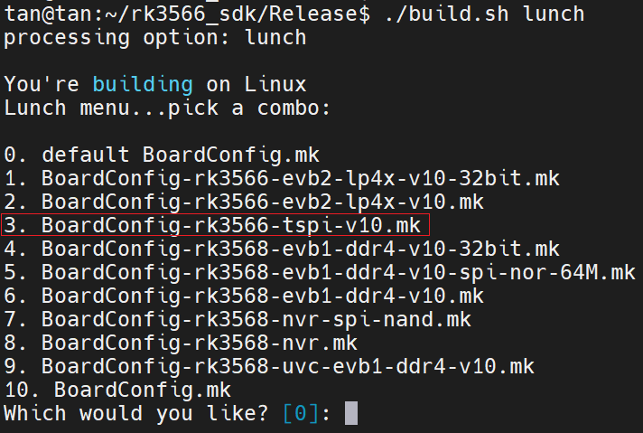
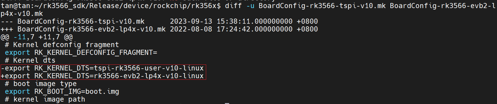
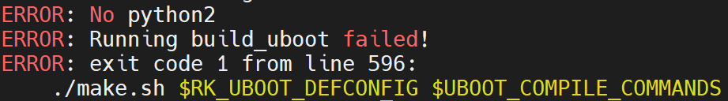
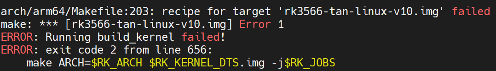

# 环境搭建

## 依赖文件
- 泰山派sdk: tspi_linux_sdk_20230916.tar.gz

## SDK解压与部署
```bash
# 配置编译环境
sudo apt-get install git ssh make gcc libssl-dev liblz4-tool expect \
g++ patchelf chrpath gawk texinfo chrpath diffstat binfmt-support \
qemu-user-static live-build bison flex fakeroot cmake gcc-multilib \
g++-multilib unzip device-tree-compiler ncurses-dev

# 解压并进入
tar -xzf tspi_linux_sdk_20230916.tar.gz
cd Release

# 编辑bashrc文件
sudo apt install vim
vi ~/.bashrc

export RK3566_SDK=~/rk3566_sdk/Release
export PATH=$RK3566_SDK/prebuilts/gcc/linux-x86/aarch64/gcc-linaro-6.3.1-2017.05-x86_64_aarch64-linux-gnu/bin:$PATH
export ARCH=arm64
export CROSS_COMPILE=aarch64-linux-gnu-

# 使配置生效
source ~/.bashrc

# 检查是否生效
aarch64-linux-gnu-gcc -v

```
## 编译

- ./build.sh lunch, 列出所有可用的.mk板级配置文件


- diff -u, 对比泰山派配置与原厂EVB配置的修改内容


- OK, 明确了只改动了dts, 那么就可以添加自己的板级配置文件以及dts文件了(参考原厂并学习tspi的设计哲学)
```bash
cd kernel/arch/arm64/boot/dts/rockchip
cp rk3566-evb2-lp4x-v10.dtsi rk3566-tan-board-v10.dtsi
cp rk3566-evb2-lp4x-v10-linux.dts rk3566-tan-linux-v10.dts

cd device/rockchip/rk356x
cp BoardConfig-rk3566-evb2-lp4x-v10.mk BoardConfig-rk3566-tan-v10.mk

```

- 当然也可以添加自己的defconfig
    - rk3566_sdk/Release/kernel/arch/arm64/configs

- 编译
```bash
# 选择新增的板级配置文件
./build.sh lunch

# 全量编译
./build.sh all

# 固件打包
./mkfirmware.sh
./build.sh updateimg

```

## 编译报错

- 未安装python2



```bash
sudo apt install python-minimal
```

- 未设置电源域



```bash
&pmu_io_domains {
	status = "okay";
	pmuio1-supply = <&vcc3v3_pmu>;
	pmuio2-supply = <&vcc3v3_pmu>;

	vccio1-supply = <&vccio_acodec>;
	vccio3-supply = <&vccio_sd>;
	vccio4-supply = <&vcc_1v8>;
	vccio5-supply = <&vcc_3v3>;
	vccio6-supply = <&vcc_1v8>;
	vccio7-supply = <&vcc_3v3>;
};
```
